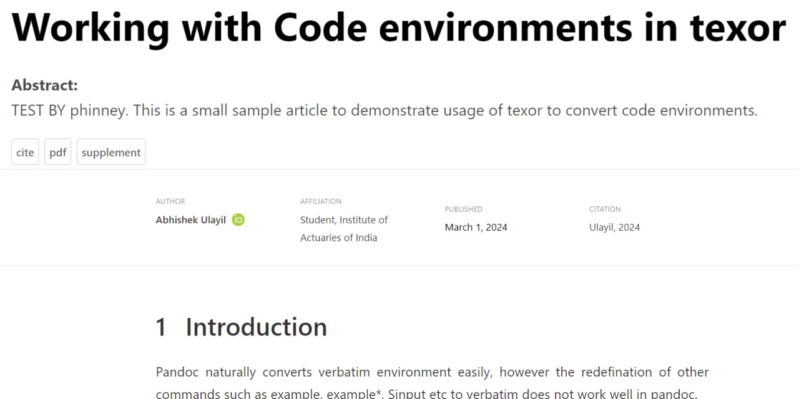
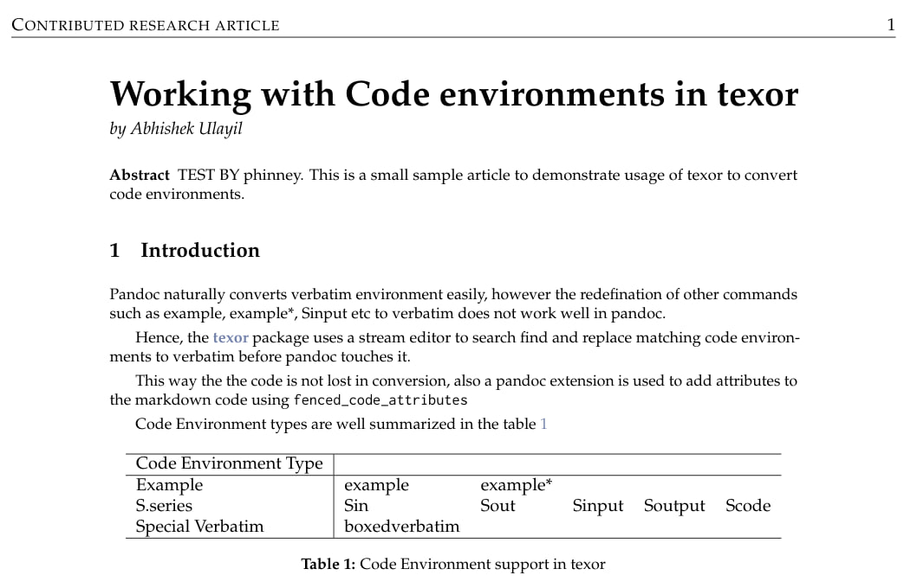

```{r setup, include=FALSE}
library("texor")
```

# About Me

- Name: Yinxiang Huang

- Email: Hxy903269428\@gmail.com

- programming Languages: Python, C++, C, R, C\#, Rust, Javascript, Shell, Lua, etc.

- Tools: Git, AWS, Google Cloud, Google Colab, Jupyter Notebook, etc.

- Profile: I am new to the open source community and have created pull requests to fix bugs in other open source repositories before. Helping others excites me. Additionally, I've built some small projects for practice out of personal interest. Currently my area of expertise uses R a lot, so I am interested in maintaining R packages. I hope that my mentors will provide me with an opportunity to contribute to the community.

# Test Results

## Easy Test

- Select any sub-directory apart form `bibliography` and `lua-filters` in the supplementary materials on the [texor-rjarticle](https://github.com/Abhi-1U/texor-rjarticle/tree/master/supplement) repository. Open the example LaTeX source file (not the wrapper `RJwrapper.tex`), add the phrase "TEST BY " at the start of the abstract (substituting your name for the placeholder!) and save. Follow these [instructions](https://github.com/Abhi-1U/texor-rjarticle/blob/master/supplement/code-env/README.md) to convert the LaTeX article to HTML. Compare the PDF and HTML versions side by side to understand the conversion process of the LaTeX articles. Include the generated Rmd file as the outcome of the test.

### Solution

- I run the following code to convert the LaTeX article to HTML and pdf, and then compare the PDF and HTML versions side by side.

- The screenshot of the HTML and PDF versions are shown below.

```{r easy, echo=TRUE, message=FALSE, eval = FALSE}
remotes::install_github("Abhi-1U/rebib")
remotes::install_github("Abhi-1U/texor")

rmarkdown::pandoc_version()

article_dir <- "C:\\Users\\phinney\\Desktop\\texor\\code-env"
texor::latex_to_web(article_dir)
```

{#id .class width=60% height=60%}

{#id .class width=60% height=60%}

## Medium Test

- Read the supplementary article on [Lua Filters](https://github.com/Abhi-1U/texor-rjarticle/blob/master/supplement/lua-filters/RJwrapper.pdf). This introduces the `image_number_filter.lua` filter, which may be used with pandoc as follows:

    ```sh
    pandoc example.md --from markdown \
    --to html5 \
    --output filtered-example.html \
    --lua-filter image_numbering_filter.lua
    ```

- Write an R function that takes an example Markdown file with multiple figures and converts it to HTML optionally with or without using `image_number_filter.lua`. Document the function using Roxygen2 notation. Write an R script and example Markdown file to demonstrate the use of your function. HINT: you may use `rmarkdown::pandoc_convert`.

### Solution

- My function `markdown2html` is documented using Roxygen2 notation below, you can also find the function in the `MediumTest/Medium.R` file:

```{r medium, echo=TRUE, message=FALSE, eval = FALSE}

#' take a Markdown file with multiple figures and converts it to HTML 
#' optionally with or without using `image_number_filter.lua`.
#'
#' @param md_file_path the path of markdown file.
#' @param image_numer_filter whether or not to label images with serial numbers.
#' @return conversion results.
#' @examples
#' markdown2html("example.md", image_numer_filter = TRUE)
#' markdown2html("example.md")
markdown2html <- function(md_file_path, image_numer_filter = FALSE) {
  if (image_numer_filter) {
    output_file_name <- sub(".md$", "_filtered.html", basename(md_file_path))
  } else {
    output_file_name <- sub(".md$", ".html", basename(md_file_path))
  }
  
  tryCatch({
    rmarkdown::pandoc_convert(input = md_file_path, 
                              from = "markdown",
                              to = "html5", 
                              output = output_file_name, 
                              # verbose = TRUE,
                              options = ifelse(image_numer_filter, 
                                         "--lua-filter=image_numbering_filter.lua", ""))
  
    return(list(success = TRUE, message = "Conversion completed successfully."))
  }, error = function(e) {
    return(list(success = FALSE, message = paste("Conversion failed:", e$message)))
  })
}

```

## Hard Test

- Write a Custom Pandoc Reader in Lua to just extract code chunks from Sweave files and treat them as CodeBlocks. You can clone some example sweave files from the [knitr-examples](https://github.com/yihui/knitr-examples/tree/master) repository to test and demonstrate your reader. HINT: the [plain text reader](https://pandoc.org/custom-readers.html#example-plain-text-reader) example can give a starting point, while the [wiki Creole reader](https://pandoc.org/custom-readers.html#example-a-wiki-creole-reader) gives an example of defining how CodeBlocks should be read.

### Solution

- I write a Pandoc Reader which extract code chunks from Sweave files and treat them as CodeBlocks. The code is shown below, or you can find the reader in the `HardTest/sweave_code_reader.lua` file. I treat the Sweave code chunks as CodeBlocks, while any other text as ignored plain text. So the script **cannot tell if the file is a syntactically correct sweave document or not**:

```{lua, eval=FALSE}
-- A sample custom reader that just read Sweave code chunks.


-- For better performance we put these functions in local variables:
local P, S, R, Cf, Cc, Ct, V, Cs, Cg, Cb, B, C, Cmt =
  lpeg.P, lpeg.S, lpeg.R, lpeg.Cf, lpeg.Cc, lpeg.Ct, lpeg.V,
  lpeg.Cs, lpeg.Cg, lpeg.Cb, lpeg.B, lpeg.C, lpeg.Cmt

local whitespacechar = S(" \t\r\n")
local spacechar = S(" \t")
local newline = P"\r"^-1 * P"\n"
local blankline = spacechar^0 * newline
local codeblockstart = P"<<"
                        * spacechar^0 -- Ignore spaces
                        * C((P(1) - P(spacechar^0 * P">>="))^0) -- Capture attributes between << and >>=
                        * spacechar^0 -- Ignore spaces
                        * ">>="

-- Grammar
G = P{ "Pandoc",
    Pandoc = Ct(V"Block"^0) / pandoc.Pandoc;
    Block = blankline^0
          * ( V"CodeBlock"
            + V"Para");
    Para = P(P(1) - codeblockstart)^1
            * newline^0;
    CodeBlock = codeblockstart
                * blankline
                * C((1 - (newline * P"@"))^0) -- Capture codes between << >>= and @
                * newline
                * P"@"
                / function(attributes, code) -- Return a CodeBlock with the captured attributes and codes
                    return pandoc.CodeBlock(code, {attributes = attributes})
                  end;
}


function Reader(input, reader_options)
    return lpeg.match(G, tostring(input))
end
```

- To test the reader, I run the following code to convert the Sweave file to AST:

```{cmd, eval=FALSE}
pandoc 002-minimal.Rnw -f sweave_code_reader.lua -t native
pandoc 008-outdec.Rnw -f sweave_code_reader.lua -t native
pandoc 011-conditional-eval.Rnw -f sweave_code_reader.lua -t native
pandoc 013-par.Rnw -f sweave_code_reader.lua -t native
```

- And results are shown below:

```{cmd, eval=FALSE}
C:\Users\phinney\Desktop\texor\HardTest>pandoc 002-minimal.Rnw -f sweave_code_reader.lua -t native
[ CodeBlock
    ( "" , [] , [ ( "attributes" , "foo, fig.height=4" ) ] )
    "1+1\nletters\nchartr('xie', 'XIE', c('xie yihui', 'Yihui Xie'))\npar(mar=c(4, 4, .2, .2)); plot(rnorm(100))"
]

C:\Users\phinney\Desktop\texor\HardTest>pandoc 008-outdec.Rnw -f sweave_code_reader.lua -t native
[ CodeBlock
    ( "" , [] , [ ( "attributes" , "" ) ] )
    "options(OutDec = ',')"
, CodeBlock
    ( "" , [] , [ ( "attributes" , "" ) ] )
    "options(OutDec = '.')"
]

C:\Users\phinney\Desktop\texor\HardTest>pandoc 011-conditional-eval.Rnw -f sweave_code_reader.lua -t native
[ CodeBlock
    ( "" , [] , [ ( "attributes" , "controller" ) ] )
    "# this variable controls if a chunk should be evaluated\ndothis <- TRUE"
, CodeBlock
    ( "" , [] , [ ( "attributes" , "chunk1, eval = dothis" ) ] )
    "print('say hello world')"
, CodeBlock
    ( ""
    , []
    , [ ( "attributes" , "chunk2, eval = !dothis" ) ]
    )
    "print('silence is gold')"
]

C:\Users\phinney\Desktop\texor\HardTest>pandoc 013-par.Rnw -f sweave_code_reader.lua -t native
[ CodeBlock
    ( "" , [] , [ ( "attributes" , "setup" ) ] )
    "library(knitr)\nknit_hooks$set(pars = function(before, options, envir) {\n  if (before) do.call(graphics::par, options$pars)\n})"
, CodeBlock
    ( ""
    , []
    , [ ( "attributes"
        , "myplot, pars=list(mar = c(4, 4, .1, .1))"
        )
      ]
    )
    "hist(rnorm(100), main = '')  # no main title"
]
```